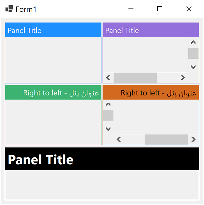

# Panel Titlebar

In this exaample I've added a titlebar to the panel by extending the nonclient area of the panel and painting on the nonclient area.

The panel has derived from a standard panel and in addition to the standard properties, support the following properties:

- `Text`: The title of the panel
- `TitlebarForeColor`: The foreground colore of the titlebar
- `TitlebarBackColor`: The background colore of the titlebar. This color will be used for border as well.
- `TitlebarFont`: The fornt of the title
- `TitlebarTextPadding`: The padding around the title
- `ShowTitlebar`: Determines visibility of the titlebar

